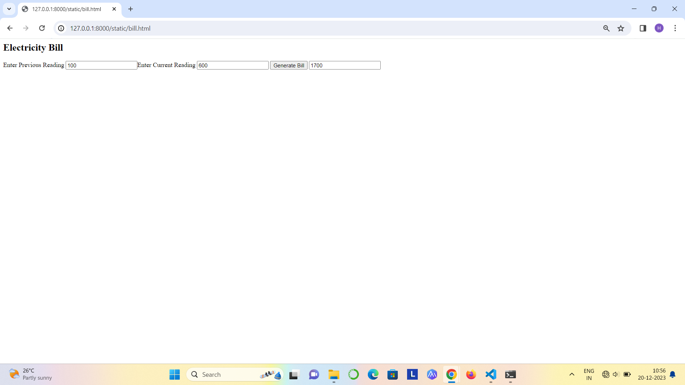
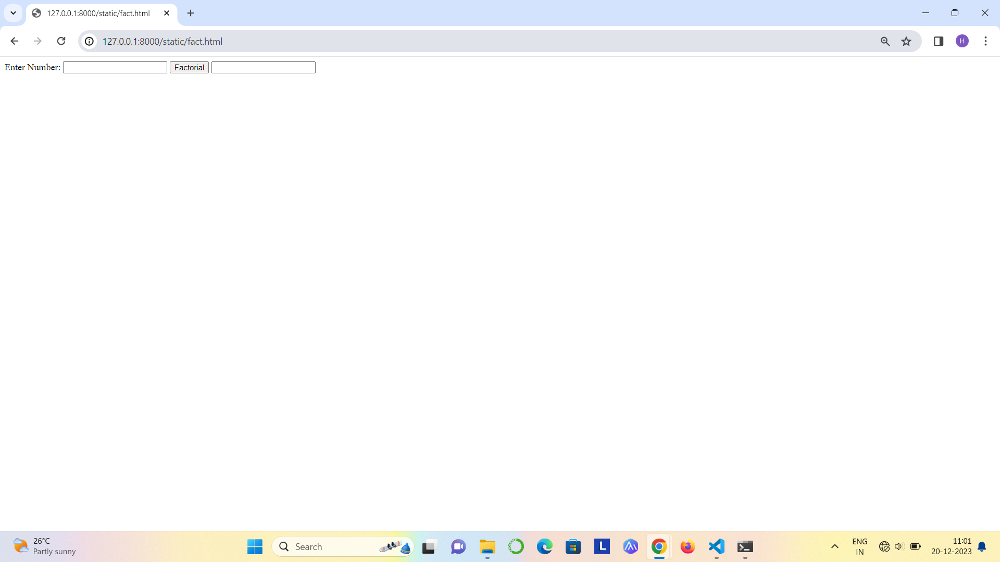
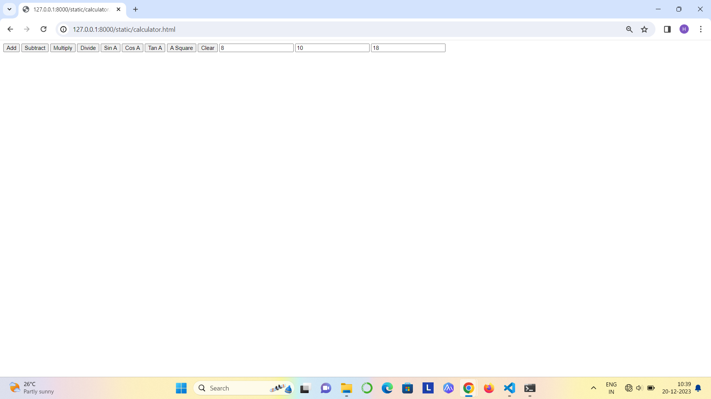
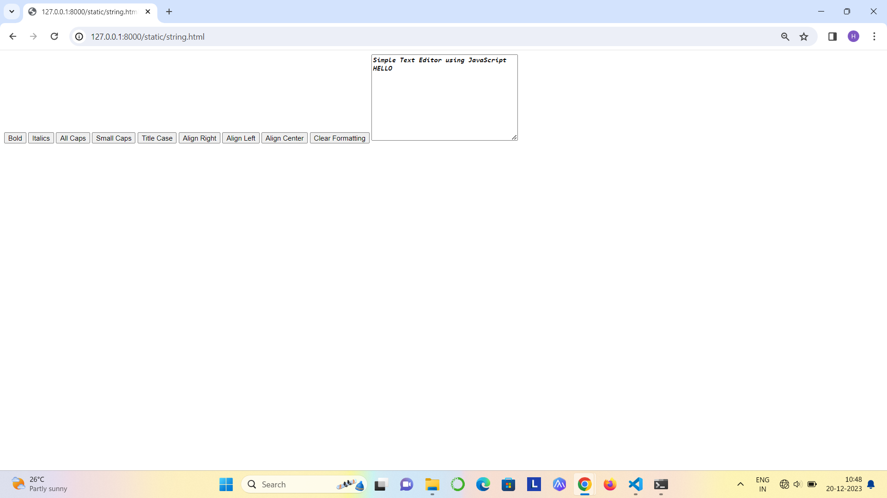
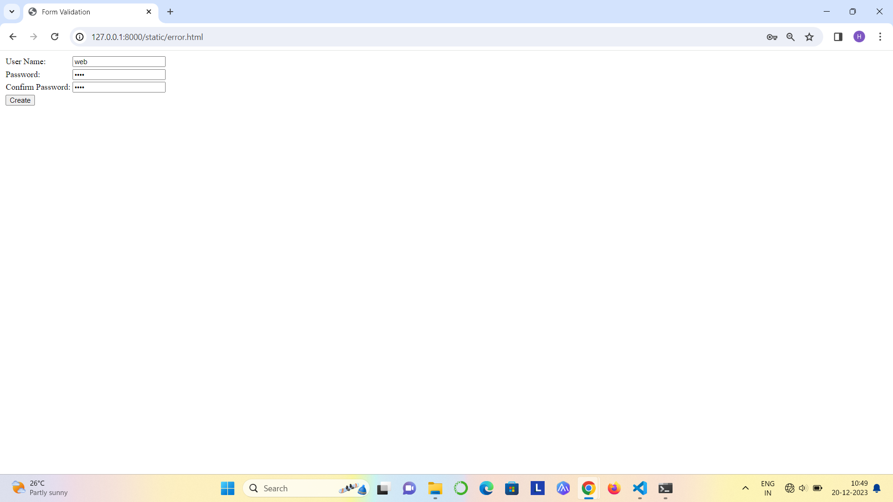

# ODD23-24-WT-JavaScript

NAME: HARITHA RAMESH

REFERENCE NUMBER: 23003324

DEPARTMENT: CSE(CYBER SECURITY)

# PROGRAM 1
## AIM:
 To create a form with java script code to calculate electricity bill.

## DESIGNING PROCEDURE:
STEP 1: Start define the document as HTML.

STEP 2: Open the HTML structure with necessary head and body .Give the script type as text/javascript.

STEP 3: Define the function for the program as calc().

STEP 4: Give the necessary input that is required for calculating the electricity bill like var prev,curr,units,amt. Get the number for input using document.getElementById.

STEP 5: Give the necessary condition using if-else condition.
Close the script and head  tags.

STEP 6: Give the input type in the body of the HTML.

STEP 6 : End the HTML structure.

## PROGRAM:
```
<!DOCTYPE html>
<html>
<head>
<script type="text/javascript">
function calc()
{
var prev,curr,units,amt;
prev=Number(document.getElementById("t1").value);
curr=Number(document.getElementById("t2").value);
units=curr-prev;
if(units<=100)
	amt=100;
else if(units>100&&units<=300)
	amt=100+(units-100)*3;
else
	amt=100+600+(units-300)*5;
document.getElementById("t3").value=amt;
}
</script>
</head>
<body>
<h2>Electricity Bill</h2>
<form>
Enter Previous Reading 
<input type="text" id="t1">Enter Current Reading
<input type="text" id="t2">
<input type="button"  onclick="calc()" value="Generate Bill">
<input type="text" id="t3">
</form>
</body>
</html>
```
## OUTPUT:


## RESULT:
Thus the java code executed to calculate the electricity bill.

 # PROGRAM 2 

## AIM:
 To create a form with java script code  to compute the factorial of a given number without recursion.
## DESIGNING PROCEDURE:

STEP 1: Start define the document as HTML.

STEP 2: Open the HTML structure with necessary head and body .Give the script type as text/javascript.

STEP 3: Define the function for the program as show().

STEP 4: Give the necessary input that is require to compute the factorial like var i, n, fact. Get the number for input using document.getElementById.

STEP 5: Using for-loop condition calculate the factorial.
Close the script and head  tags.

STEP 6: Give the input type in the body of the HTML.

STEP 6 : End the HTML structure.

## PROGRAM:
```
<!DOCTYPE html>
<html>
<head>
<script type="text/javascript">
function show()
{
var i, n, fact;
fact=1;
n=Number(document.getElementById("num").value);
for(i=1; i<=n; i++)  
{
fact= fact*i;
}  
document.getElementById("answer").value= fact;
}
</script>
</head>
<body>
<form>
Enter Number: <input type="text" id="num">
<button onclick="show()">Factorial</button>
<input type="text" id="answer">
</form>
</body>
</html>

```
## OUTPUT:


## RESULT:
Thus the java code executed to compute the factorial of a given number without recursion.

# PROGRAM 3 
## AIM:
To construct a JavaScript code to generate ‘N’ prime numbers.
## DESIGNING PROCEDURE:
STEP 1: Start define the document as HTML.

STEP 2: Open the HTML structure with necessary head and body .Give the script type as text/javascript.

STEP 3: Define the function for the program as show().

STEP 4: Give the necessary input that is required to construct a java code to generate ‘N’ prime numbers . Get the number for input using document.getElementById.

STEP 5: Using for-loop condition  generate ‘N’ prime numbers. Close the script and head  tags.

STEP 6: Give the input type in the body of the HTML.

STEP 6 : End the HTML structure.

## PROGRAM:
```
<!DOCTYPE html>
<html>
<head>
<script type="text/javascript">
function show()
{
var low=Number(document.getElementById("n1").value);
var high=Number(document.getElementById("n2").value);
var i,j;
for(i=low;i<=high;i++) 
{
var flag=0;
for(j=2;j<i;j++) 
{
if(i%j==0) 
{
flag=1;
break;
}
}
if(flag==0&&i>1) 
alert(i);
}
}
</script>
</head>
<body>
<form>
<input type="text" id="n1">
<input type="text" id="n2">
<input type="button" onclick="show()" value="Generate">
</form>
</body>
</html>

```

## OUTPUT:


## RESULT:
Thus the java code executed to construct a JavaScript code to generate ‘N’ prime numbers.

# PROGRAM 4
## AIM:
 To construct a JavaScript program to implement a simple calculator.

 ## DESIGNING PROCEDURE:
 STEP 1: Start define the document as HTML.

STEP 2: Open the HTML structure with necessary head and body .Give the script type as text/javascript.

STEP 3: Define the function for the program as function f1() for addition, function f2() for subtraction, function f3() for multiplication, function f4() for division, function f5() for sin(a), function f6() for cos(a) ,function f7() for tan(a), function f8() for a*a , function f9() for clear.

STEP 4: Give the necessary input that is required to implement a simple calculator. Get the number for input using document.getElementById.

STEP 5: Close the script and head  tags.

STEP 6: Give the input type in the body of the HTML.

STEP 7: End the HTML structure.

## PROGRAM:
```
<!DOCTYPE html>
<html>
<head>
<script type="text/javascript">
function f1()
{
var a=Number(document.getElementById("n1").value);
var b=Number(document.getElementById("n2").value);
document.getElementById("n3").value=a+b;
}
function f2()
{
var a=Number(document.getElementById("n1").value);
var b=Number(document.getElementById("n2").value);
document.getElementById("n3").value=a-b;
}
function f3()
{
var a=Number(document.getElementById("n1").value);
var b=Number(document.getElementById("n2").value);
document.getElementById("n3").value=a*b;
}
function f4()
{
var a=Number(document.getElementById("n1").value);
var b=Number(document.getElementById("n2").value);
document.getElementById("n3").value=a/b;
}
function f5()
{
var a=Number(document.getElementById("n1").value);
var b=Number(document.getElementById("n2").value);
document.getElementById("n3").value=Math.sin(a);
}
function f6()
{
var a=Number(document.getElementById("n1").value);
var b=Number(document.getElementById("n2").value);
document.getElementById("n3").value=Math.cos(a);
}
function f7()
{
var a=Number(document.getElementById("n1").value);
var b=Number(document.getElementById("n2").value);
document.getElementById("n3").value=Math.tan(a);
}


function f8()
{
var a=Number(document.getElementById("n1").value);
var b=Number(document.getElementById("n2").value);
document.getElementById("n3").value=a*a;
}
function f9()
{
document.getElementById("n1").value=" ";
document.getElementById("n2").value=" ";
document.getElementById("n3").value=" ";
}
</script>
</head>
<body>
<form>
<input type="button" onclick="f1()"  value="Add">
<input type="button" onclick="f2()"  value="Subtract">
<input type="button" onclick="f3()"  value="Multiply">
<input type="button" onclick="f4()"  value="Divide">
<input type="button" onclick="f5()"  value="Sin A">
<input type="button" onclick="f6()"  value="Cos A">
<input type="button" onclick="f7()"  value="Tan A">
<input type="button" onclick="f8()"  value="A Square">
<input type="button" onclick="f9()"  value="Clear">
<input type="text" id="n1">
<input type="text" id="n2">
<input type="text" id="n3">
</form>
</body>
</html>


```
## OUTPUT:




## RESULT:
Thus the java code executed to implement a simple calculator.

# PROGRAM 5
## AIM:
 To design a simple text editor JavaScript application where we can manipulate the user input in different styles, edit the input, capitalize, and many string operations.
 ## DESIGNING PROCEDURE:
 STEP 1: Start define the document as HTML.

STEP 2: Open the HTML structure with necessary head and body .Give the script type as text/javascript.

STEP 3: Define the function for the program as function f1() for bold, function f2() for italics, function f3() for uppercase, function f4() for lowercase, function f5() for capitalize, function f6() for right ,function f7() for left, function f8() for center, function f9() for clear formatting.

STEP 4: Give the necessary input that is required to design a simple text editor JavaScript application where we can manipulate the user input in different styles, edit the input, capitalize, and many string operations. Get the number for input using document.getElementById.

STEP 5: Close the script and head  tags.

STEP 6: Give the input type in the body of the HTML.

STEP 6 : End the HTML structure.

## PROGRAM:

```
<!DOCTYPE html>
<html>
<head>
<script type="text/javascript">
function f1()
{
document.getElementById("num").style.fontWeight="bold";
}
function f2()
{
document.getElementById("num").style.fontStyle="italic";
}
function f3()
{
document.getElementById("num").style.textTransform="uppercase";
}
function f4()
{
document.getElementById("num").style.textTransform="lowercase";
}
function f5()
{
document.getElementById("num").style.textTransform="capitalize";
}
function f6()
{
document.getElementById("num").style.textAlign="right";
}
function f7()
{
document.getElementById("num").style.textAlign="left";
}
function f8()
{
document.getElementById("num").style.textAlign="center";
}


function f9()
{
document.getElementById("num").style.fontWeight = "normal";
document.getElementById("num").style.textAlign = "left";
document.getElementById("num").style.fontStyle = "normal";
}
</script>
</head>
<body>
<form>
<input type="button" onclick="f1()"  value="Bold">
<input type="button" onclick="f2()"  value="Italics">
<input type="button" onclick="f3()"  value="All Caps">
<input type="button" onclick="f4()"  value="Small Caps">
<input type="button" onclick="f5()"  value="Title Case">
<input type="button" onclick="f6()"  value="Align Right">
<input type="button" onclick="f7()"  value="Align Left">
<input type="button" onclick="f8()"  value="Align Center">
<input type="button" onclick="f9()"  value="Clear Formatting">
<textarea rows="10" cols="35" id="num">
Simple Text Editor using JavaScript
</textarea>
</form>
</body>
</html>

```
## OUTPUT:


## RESULT:
Thus the java code executed to design a simple text editor JavaScript application where we can manipulate the user input in different styles, edit the input, capitalize, and many string operations.

# PROGRAM 6:

## AIM:
  To design a JavaScript program which displays error messages when a field in form is entered incorrectly.

 ## DESIGNING PROCEDURE:

STEP 1: Start define the document as HTML.

STEP 2: Open the HTML structure with necessary head and body .Give the script type as text/javascript.

STEP 3: Define the function for the program as  validate().

STEP 4: Give the necessary input that is required to design a JavaScript program which displays error messages when a field in form is entered incorrectly.Get the number for input using document.getElementById.

STEP 5: Using for-loop condition and if-else condition displays error messages when a field in form is entered incorrectly. Close the script and head  tags.

STEP 6: Give the input type in the body of the HTML.

STEP 6 : End the HTML structure.

## PROGRAM :
```
<!DOCTYPE html>
<html>
<head>
  <title>Form Validation</title>
  <script type="text/javascript">
    var divs = new Array();
    divs[0] = "errUserName";
    divs[1] = "errPassword";
    divs[2] = "errConfirm";
    function validate()
	{
      var inputs = new Array();
      inputs[0] = document.getElementById('username').value;
      inputs[1] = document.getElementById('password').value;
      inputs[2] = document.getElementById('confirm').value;
      var errors = new Array();
      errors[0] = "<span style='color:red'>Please enter your Username!</span>";
      errors[1] = "<span style='color:red'>Please enter your password!</span>";
      errors[2] = "<span style='color:red'>Please confirm your password!</span>";
      for (i in inputs)
      {
        var errMessage = errors[i];
        var div = divs[i];
        if (inputs[i] == "")
        	document.getElementById(div).innerHTML = errMessage;
        else if (i==1)
        {
          var first = document.getElementById('password').value;
          var second = document.getElementById('confirm').value;
          if (second != first)
        	document.getElementById('errConfirm').innerHTML = "<span style='color: red'>Your passwords don't match!</span>";
          else
       		document.getElementById(div).innerHTML = "OK!";
        }
        else
        	document.getElementById(div).innerHTML = "OK!";
       }
     }
        function finalValidate()
        {
          var count = 0;
          for(i=0;i<2;i++)
          {
            var div = divs[i];
            if(document.getElementById(div).innerHTML == "OK!")
            count = count + 1;
          }
          if(count == 2)
          	document.getElementById("errFinal").innerHTML = "All the data you entered is correct!!!";
        }
   </script>
</head>
<body>
	<table id="table1">
      <tr>
        <td>User Name:</td>
        <td><input type="text" id="first" onkeyup="validate();" /></td>
        <td><div id="errUserName"></div></td>
      </tr>
      <tr>
        <td>Password:</td>
        <td><input type="password" id="password" onkeyup="validate();"/></td>
        <td><div id="errPassword"></div></td>
      </tr>
      <tr>
        <td>Confirm Password:</td>
        <td><input type="password" id="confirm" onkeyup="validate();"/></td>
        <td><div id="errConfirm"></div></td>
      </tr>
      <tr>
        <td><input type="button" id="create" value="Create" onclick="validate();finalValidate();"/></td>
        <td><div id="errFinal"></div></td>
      </tr>
	</table>
</body>
</html>


```
## OUTPUT:



## RESULT:
Thus the java code executed to design a JavaScript program which displays error messages when a field in form is entered incorrectly.

